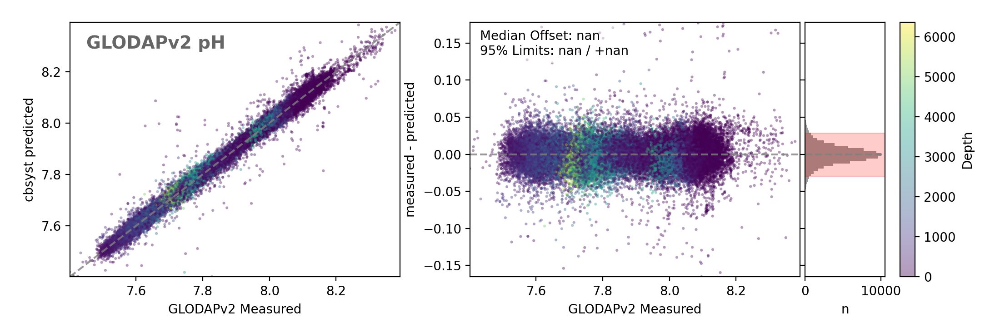
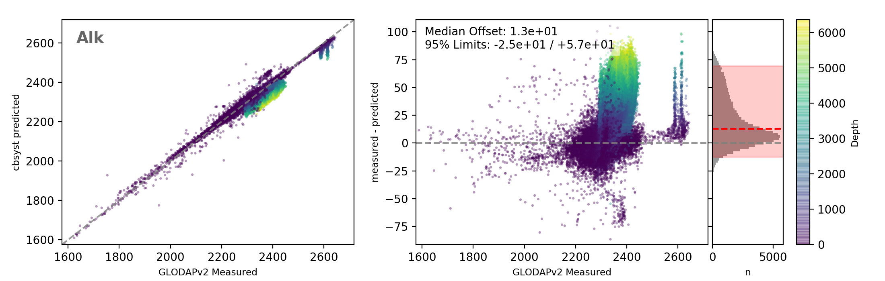
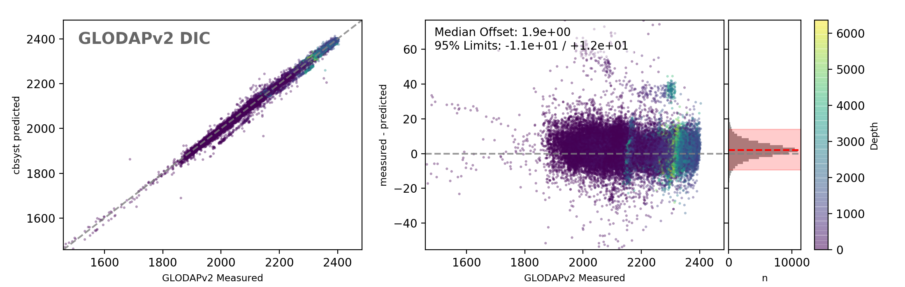

# cbsyst

**A Python module for calculating seawater carbon and boron chemistry**

*Work in progress! Tested against reference data, but results not guaranteed. Use at your own risk.*

## Still To Do...
- [X] [Nutrient alkalinity](https://github.com/oscarbranson/cbsyst/issues/5)
- [ ] [Different pH scales](https://github.com/oscarbranson/cbsyst/issues/7)
- [ ] [Separate input / output conditions](https://github.com/oscarbranson/cbsyst/issues/3)
- [ ] [Ravelle factor reporting](https://github.com/oscarbranson/cbsyst/issues/8)
- [ ] [Compare to CO2SYS](https://github.com/oscarbranson/cbsyst/issues/6), a la [Orr et al (2015)](http://www.biogeosciences.net/12/1483/2015/bg-12-1483-2015.pdf)?

If anyone wants to help with any of this, please do contribute!

## Constants
Constants calculated by an adaptation of [Mathis Hain's MyAMI model](http://www.mathis-hain.net/resources/Hain_et_al_2015_GBC.pdf). 
The [original MyAMI code](https://github.com/MathisHain/MyAMI) is available on GitHub.
A stripped-down version of MyAMI is [packaged with cbsyst](cbsyst/MyAMI_V2.py).
It has been modified to make it faster (by vectorising) and more 'Pythonic'.
All the Matlab interface code has been removed.

## Calculations
Speciation calculations follow [Zeebe and Wolf-Gladrow (2001)](https://www.elsevier.com/books/co2-in-seawater-equilibrium-kinetics-isotopes/zeebe/978-0-444-50946-8).
Carbon speciation calculations are described in Appendix B.
Boron speciation calculations in Eqns. 3.4.43 - 3.4.46.

Boron isotopes are calculated in terms of fractional abundances instead of delta values, as outlines [here](cbsyst/docs/B_systematics.pdf).
Delta values can be provided as an input, and are given as an output.

Pressure corrections are applied to the calculated MyAMI constants following Eqns. 38-40 of [Millero et al (2007)](cbsyst/docs/Millero_2007_ChemicalReview.pdf), using constants in their Table 5.

## Data Comparison
I have used the [GLODAPv2 data set](cbsyst/test_data/GLODAP_data/Olsen_et_al-2016_GLODAPv2.pdf) to test how well `cbsyst` works with modern seawater.

### Method:
Import the entire GLODAPv2 data set, remove all data where `flag != 2` (2 = good data), and exclude all rows that don't have all of (salinity, temperature, pressure, tco2, talk, and phtsinsitutp) - i.e. salinity, temperature, pressure and all three measured carbonate parameters.
The resulting dataset contains 97,963 bottle samples. 
The code used to process the raw GLODAPv2 data is available [here](cbsyst/test_data/GLODAP_data/get_GLODAP_data.py).

Next, calculate the carbonate system from sets of two of the measured carbonate parameters, and compare the calculated third parameter to the measured third parameter (i.e. calculate Alkalinity from pH and DIC, then compared calculated vs. measured Alkalinities). The code for making these comparison plots is [here](cbsyst/test_data/GLODAP_data/plot_GLODAPv2_comparison.py).

### Results:
**Predicted pH** (from DIC and Alkalinity) is offset from measured values by -0.0041 (-0.031/+0.029).


**Predicted Alkalinity** (from pH and DIC) is offset from measured values by -1.5 (-13/+12) umol/kg.


**Predicted DIC** (from pH and Alkalinity) is offset from measured values by 1.5 (-11/+12) umol/kg.


Reported statistics are median ±95% confidence intervals extracted from the residuals (n = 97,963).

There is a slight negative trend in the DIC residuals. Uncertain of the cause.
There are some small, outlying clusters where pH is under-estimated by ~0.1, DIC is under-estimated by 40-50 and Alk is over-estimated by ~70.
All these data points are from cruise 270.
Suspect a data problem from that cruise, as the outliers are not identified by any available parameter in the dataset.

### Conclusions:
`cbsyst` does a good job of fitting the GLODAPv2 dataset within the noise of the data!


# Installation

**Requires Python 3.5+**. 
Does *not* work in 2.7. Sorry.

```bash
pip install cbsyst
```

## Example Usage

```python
import cbsyst as cb
import numpy as np

# Create pH master variable for demo
pH = np.linspace(7,11,100)

# Example Usage
# -------------
# The following functions can be used to calculate the
# speciation of C and B in seawater, and the isotope
# fractionation of B, given minimal input parameters.
#
# See the docstring for each function for info on
# required minimal parameters.

# Carbon system only
Csw = cb.Csys(pH=pH, DIC=2000.)

# Boron system only
Bsw = cb.Bsys(pH=pH, BT=433., dBT=39.5)

# Carbon and Boron systems
CBsw = cb.CBsys(pH=pH, DIC=2000., BT=433., dBT=39.5)

# NOTE:
# At present, each function call can only be used to
# calculate a single minimal-parameter combination -
# i.e. you can't pass it multiple arrays of parameters
# with different combinations of parameters, as in
# the Matlab CO2SYS code.

# Example Output
# --------------
# The functions return a Bunch (modified dict with '.' 
# attribute access) containing all system parameters
# and constants.
#
# Output for a single input condition shown for clarity:

out = cb.CBsys(pH=8.1, DIC=2000., BT=433., dBT=39.5)
out

>>> {'ABO3': array([ 0.80882931]),
     'ABO4': array([ 0.80463763]),
     'ABT': array([ 0.80781778]),
     'BO3': array([ 328.50895695]),
     'BO4': array([ 104.49104305]),
     'BT': array([ 433.]),
     'CO2': array([ 9.7861814]),
     'CO3': array([ 238.511253]),
     'Ca': array([ 0.0102821]),
     'DIC': array([ 2000.]),
     'H': array([  7.94328235e-09]),
     'HCO3': array([ 1751.7025656]),
     'Ks': {'K0': array([ 0.02839188]),
      'K1': array([  1.42182814e-06]),
      'K2': array([  1.08155475e-09]),
      'KB': array([  2.52657299e-09]),
      'KSO4': array([ 0.10030207]),
      'KW': array([  6.06386369e-14]),
      'KspA': array([  6.48175907e-07]),
      'KspC': array([  4.27235093e-07])},
     'Mg': array([ 0.0528171]),
     'S': array([ 35.]),
     'T': array([ 25.]),
     'TA': array([ 2333.21612227]),
     'alphaB': array([ 1.02725]),
     'dBO3': array([ 46.30877684]),
     'dBO4': array([ 18.55320208]),
     'dBT': array([ 39.5]),
     'deltas': True,
     'fCO2': array([ 344.68238018]),
     'pCO2': array([ 345.78871573]),
     'pH': array([ 8.1]),
     'pdict': None}

# All of the calculated output arrays will be the same length as the longest
# input array.

# Access individual parameters by:
out.CO3

>>> array([ 238.511253])

# Output data for external use:
df = cb.data_out(out, 'example_export.csv')

# This returns a pandas.DataFrame object with all C and B parameters.
# It also saves the data to the specified file. The extension of the
# file determined the format it is saved in (see data_out docstring).

```

## Technical Note: Whats is a `Bunch`?

For code readability and convenience, I've used Bunch objects instead of traditional dicts.
A [Bunch](cbsyst/helpers.py#L6) is a modification of a dict, which allows attribute access via the dot (.) operator.
Apart from that, it works *exactly* like a normal dict (all the usual methods are available transparrently).

**Example:**
```python
from cbsyst.helpers import Bunch

# Make a bunch
bun = Bunch({'a': 1,
             'b': 2})

# Access items of bunch...
# as a dict:
bun['a']

>>> 1

# as a Bunch:
bun.a

>>> 1
```