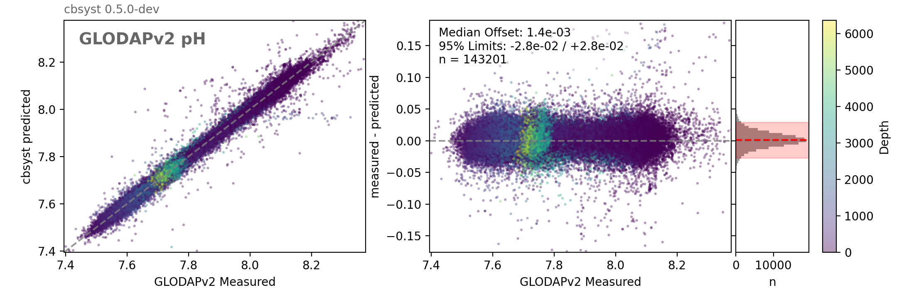
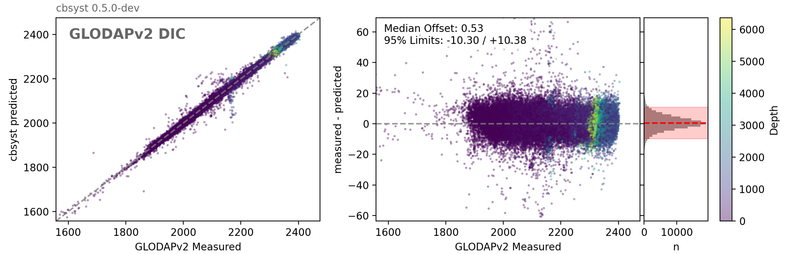
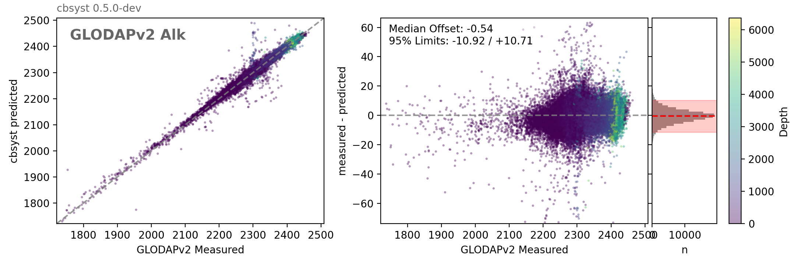

# Performance

## GLODAP Data

To evaluate the accuracy and precision of `cbsyst`, we use GLODAP data where pH, DIC and TA carbonate parameters are available.

### Measured pH cs. pH calculated from DIC and TA

### Measured DIC cs. DIC calculated from pH and TA

### Measured TA cs. TA calculated from pH and DIC

